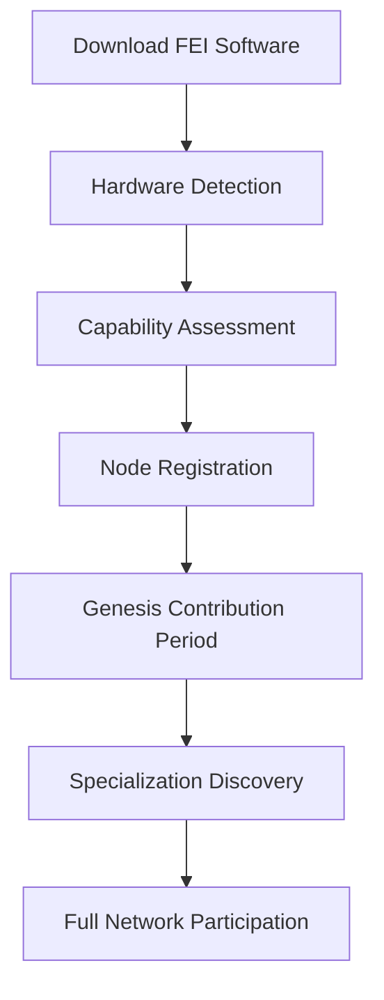
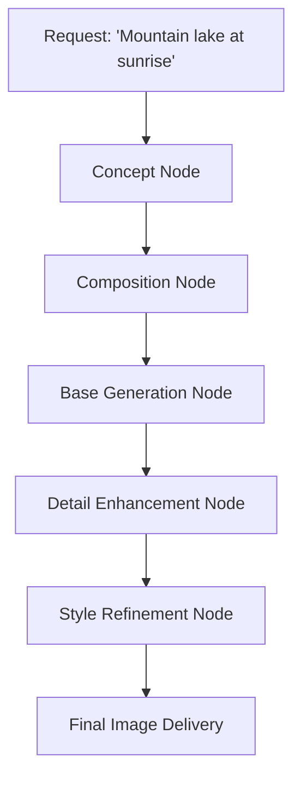
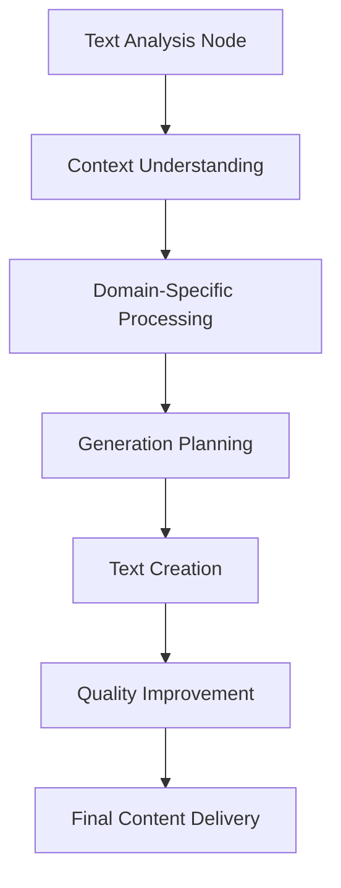
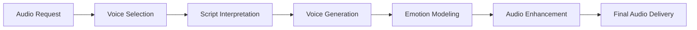
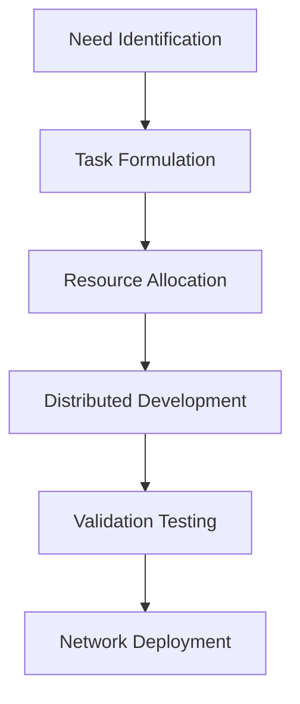
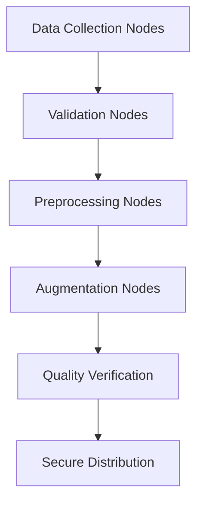
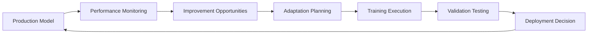

# How The FEI Network Works

## Introduction: The Living Neural Network

The FEI Network functions as a living, adaptive neural network composed of thousands of individual nodes, each with their own specializations and capabilities. Unlike traditional centralized AI services, the FEI Network operates as a self-organizing ecosystem where computational resources, model development, and intelligence emerge from the collective participation of its members.

This document explores the practical functioning of the network: how nodes join, contribute, specialize, and collaborate to create a democratized AI ecosystem that anyone can participate in simply by sharing their computational resources.

## Core Network Principles

The FEI Network operates on several fundamental principles:

1. **Radical Openness**: Anyone with computing resources can participate
2. **Emergent Specialization**: Nodes naturally specialize based on their capabilities
3. **Autonomous Organization**: The network self-organizes through quorum-based decision making
4. **Value Reciprocity**: Contributions are fairly rewarded with FeiCoin
5. **Distributed Resilience**: No single point of failure or control

## Node Lifecycle

### 1. Node Onboarding

When a new participant joins the FEI Network, the process unfolds as follows:



1. **Automated Hardware Detection**
   The FEI client automatically detects available hardware:
   ```bash
   # Example of what happens when running the join command
   $ fei-network join
   
   🔍 Detecting hardware resources...
   
   GPU Detected: NVIDIA RTX 3080
   VRAM: 10GB
   CUDA Cores: 8704
   Tensor Cores: 272
   System RAM: 32GB
   
   ✅ Your system qualifies as a Tier 3 node
   Capable of:
   - Small model training (up to 3B parameters)
   - Limited medium model inference
   - Specialized fine-tuning tasks
   - Estimated earning potential: 15-40 FeiCoin/day
   ```

2. **Capability Testing**
   The network performs benchmark tests to assess real-world performance:
   ```
   Running capability benchmarks...
   
   Matrix multiplication: 18.5 TFLOPS
   Memory bandwidth: 732 GB/s
   Model inference (Phi-2): 67 tokens/second
   Training benchmark: 392 samples/second
   
   Specialization recommendation:
   Your GPU shows strong performance for computer vision tasks.
   Consider offering specialized vision model training.
   ```

3. **Blockchain Registration**
   The node is registered on the Memorychain with a unique identity:
   ```json
   {
     "node_id": "fei-n7a291bf",
     "registration_timestamp": 1731432856,
     "hardware_profile": {
       "gpu_model": "NVIDIA RTX 3080",
       "vram_gb": 10,
       "compute_tier": 3,
       "cuda_cores": 8704,
       "tensor_cores": 272
     },
     "benchmark_results": {
       "matrix_mult_tflops": 18.5,
       "memory_bandwidth_gbps": 732,
       "inference_tokens_per_second": 67,
       "training_samples_per_second": 392
     },
     "initial_stake": 5.0,
     "network_identity": {
       "public_key": "feipub8a72bfc91cf...",
       "signature_algorithm": "ed25519"
     }
   }
   ```

### 2. Genesis Contribution Period

Every new node undergoes a "genesis period" where it performs foundational tasks to establish reputation:

1. **Initial Challenges**
   The network assigns verification tasks that:
   - Prove computational honesty
   - Validate performance claims
   - Establish baseline quality metrics

2. **Capability Expansion**
   As the node demonstrates reliability, it receives more diverse tasks:
   ```
   Genesis Task #3: Fine-tune TinyStories model
   
   Received 200MB dataset (children's stories)
   Training configuration:
   - 2 epochs, learning rate 3e-5
   - Validation at 20% intervals
   - Target perplexity < 2.8
   
   Progress: ████████████████████ 100%
   Validation perplexity: 2.65
   
   ✅ Task completed successfully
   Network consensus: 17/20 nodes validated your results
   Earned: 3.2 FeiCoin + 0.15 Reputation
   ```

3. **Specialization Discovery**
   The network analyzes performance across different tasks to recommend specializations:
   ```
   Based on your node's performance across 15 genesis tasks,
   we've identified potential specializations:
   
   🥇 Image Generation (98.7% efficiency)
   🥈 Computer Vision (96.2% efficiency)
   🥉 Text Embeddings (89.3% efficiency)
   
   Would you like to declare a specialization now?
   [Yes/No/Remind me later]
   ```

### 3. Full Network Participation

Once established, nodes participate in network activities based on their capabilities:

1. **Task Bidding System**
   Tasks are broadcast to capable nodes which can bid for assignments:
   ```
   New task available: Fine-tune vision model for medical imaging
   
   Task details:
   - Dataset: 50,000 X-ray images (2.3GB)
   - Base model: MedVision-Base (1.5B params)
   - Priority: High (hospital waiting)
   - Estimated duration: 5-7 hours
   - Reward: 11-15 FeiCoin + reputation bonus
   
   Your capability match: 94%
   Competing nodes: 7 other nodes eligible
   
   Bid now? [Yes/No]
   ```

2. **Autonomous Scheduling**
   Node operators can set availability schedules:
   ```python
   # Example of policy configuration
   node.set_availability_policy({
     "schedule": {
       "weekdays": {"start": "18:00", "end": "08:00"},
       "weekends": {"start": "00:00", "end": "23:59"}
     },
     "task_preferences": {
       "min_reward": 2.0,
       "preferred_categories": ["vision", "image-gen", "embeddings"],
       "excluded_categories": ["video-processing"]
     },
     "resource_limits": {
       "max_vram_utilization": 0.9,
       "max_power_watts": 280,
       "thermal_limit_celsius": 78
     }
   })
   ```

3. **Dynamic Resource Allocation**
   The network optimizes resource utilization across the ecosystem:
   ```
   Current network status:
   - 12,487 active nodes
   - 72% network efficiency 
   - 34% surplus vision capacity
   - 17% deficit in NLP capacity
   
   Your node has been dynamically revalued:
   - NLP tasks: +15% reward premium
   - Vision tasks: -10% reward adjustment
   ```

## Specialization Ecosystems

As the network matures, specialized sub-networks emerge organically based on node capabilities and interests. These specializations create focused ecosystems within the larger network:

### 1. Mathematical Computation Nodes

Specialized in complex mathematical tasks, statistical analysis, and scientific computing.


**Example Task Flow**:
1. A research institute submits a complex fluid dynamics simulation task
2. The network decomposes this into mathematical subtasks
3. Mathematical nodes work on individual equations and simulations
4. Results undergo verification through a quorum of other math nodes
5. The full solution is assembled and delivered
6. All contributing nodes receive FeiCoin proportional to their contribution

**Unique Characteristics**:
- High precision validation protocols
- Multi-step verification requirements
- Scientific computing specialization
- Optimization for equation processing

**Real-world Application**:
```
Task: Protein Folding Simulation for COVID-19 research
Participating nodes: 347 mathematical computation nodes
Time to completion: 4.3 hours (vs. 7.2 days on single supercomputer)
FeiCoin distributed: 1,452 across participating nodes
Result: Novel protein binding site discovered, results published in Nature
```

### 2. Image Generation Specialists

Nodes focused on creating and manipulating visual content.



**Example Task Flow**:
1. A user requests "Professional portrait for business website"
2. Concept nodes interpret and expand the request
3. Composition nodes determine framing, lighting, and proportions
4. Generation nodes create the base image
5. Enhancement nodes add photorealistic details
6. Refinement nodes apply professional styling
7. The final image is delivered after node consensus on quality

**Unique Characteristics**:
- Collaborative pipeline processing
- Style-specific specializations
- Quality-weighted rewards
- User feedback integration

**Real-world Application**:
```
Business request: "Generate product catalog images for 200 clothing items"
Participating nodes: 58 image generation specialists
Process:
1. Automated processing of product photos through enhancement pipeline
2. Style consistency enforced through template nodes
3. Background standardization across all images
4. Batch output approved through quality verification quorum

Result: 200 professional product images completed in 35 minutes
Total cost: 85 FeiCoin (vs. 1,200 FeiCoin traditional cost estimate)
```

### 3. Video Creation Network

Specialized in generating and processing video content through coordinated node clusters.


**Example Task Flow**:
1. A marketing agency needs an explainer video
2. Storyboard nodes develop the sequence and timing
3. Scene composition nodes design each major scene
4. Frame generation nodes create the individual frames
5. Motion coherence nodes ensure smooth transitions
6. Audio synchronization nodes align narration/music
7. Rendering nodes assemble the final product

**Unique Characteristics**:
- Sequential processing dependencies
- Temporal consistency requirements
- Distributed rendering architecture
- Frame-specific specializations

**Real-world Application**:
```
Project: 2-minute product explainer video
Node participation:
- 5 high-tier storyboard/planning nodes
- 28 mid-tier frame generation nodes
- 12 motion coherence specialists
- 3 audio synchronization nodes
- 8 rendering consolidation nodes

Completion time: 3.2 hours
Total FeiCoin distributed: 172
Client feedback: "Indistinguishable from professional studio work"
```

### 4. Natural Language Processing Cluster

Focused on understanding, generating, and translating human language.



**Example Task Flow**:
1. A global company needs content translated into 12 languages
2. Analysis nodes process the content structure
3. Context nodes ensure meaning preservation
4. Domain nodes apply industry-specific terminology
5. Language specialist nodes perform translations
6. Quality nodes refine and verify accuracy
7. Integration nodes assemble multilingual content

**Unique Characteristics**:
- Language-specific node specializations
- Domain expertise differentiation
- Hierarchical verification system
- Reference knowledge integration

**Real-world Application**:
```
Task: Translate technical documentation (450 pages) into 12 languages
Network organization:
- Source material divided into 126 sections
- Each section assigned to specialized language nodes
- Domain-specific terminology verified by expert nodes
- Cross-validation through back-translation

Results:
- Completion time: 7.3 hours
- Traditional agency estimate: 3-4 weeks
- Cost savings: 89% compared to professional translation services
- Quality rating: 97.3% accuracy (independently verified)
```

### 5. Audio Processing Ecosystem

Specialized in generating, processing, and enhancing audio content.



**Example Task Flow**:
1. A podcaster needs intro music and voiceover
2. Style nodes determine appropriate audio aesthetics
3. Voice selection nodes identify optimal voice models
4. Generation nodes create raw audio content
5. Emotion nodes add natural inflection and emphasis
6. Enhancement nodes optimize audio quality
7. Finalization nodes master for distribution platforms

**Unique Characteristics**:
- Waveform specialization
- Voice-specific expertise
- Acoustic environment modeling
- Platform-specific optimization

**Real-world Application**:
```
Project: Audiobook creation (352-page novel)
Process flow:
1. Text preprocessing by NLP nodes
2. Character voice assignment through voice selection nodes
3. Narrative passages assigned to storytelling specialist nodes
4. Dynamic emotion modeling based on scene analysis
5. Chapter assembly with consistent audio characteristics
6. Final mastering for audiobook platforms

Completion: 12.4 hours
Traditional studio estimate: 2-3 weeks
Author feedback: "Indistinguishable from professional narration"
```

## Network-Level Intelligence

The true power of the FEI Network emerges from its ability to seamlessly coordinate specialized node clusters into intelligent workflows:

### 1. Quorum-Based Decision Making

The network employs Byzantine fault-tolerant consensus mechanisms to make critical decisions:

```python
# Example of quorum mechanism implementation
def network_decision(proposal, required_consensus=0.67):
    """Network-level decision making through node voting"""
    eligible_voters = get_eligible_nodes(proposal.domain, min_reputation=0.75)
    
    # Distribute proposal for evaluation
    votes = collect_votes(eligible_voters, proposal, timeout=3600)
    
    # Process voting results
    positive_votes = sum(1 for v in votes if v.decision == "approve")
    consensus_level = positive_votes / len(votes)
    
    if consensus_level >= required_consensus:
        # Execute the approved action
        execute_network_action(proposal)
        reward_participants(votes)
        return True
    else:
        # Proposal rejected
        log_rejected_proposal(proposal, consensus_level)
        return False
```

Examples of quorum-decided network actions:

1. **Model Addition Decisions**
   ```
   Proposal: Add MathGenius-2B to FEI Model Registry
   Voters: 178 mathematical computation specialists
   Results: 92% approval
   Decision: Model accepted into registry
   Network-wide announcement: "MathGenius-2B model now available for inference tasks"
   ```

2. **Task Priority Adjustments**
   ```
   Proposal: Prioritize medical imaging tasks for next 72 hours
   Context: Ongoing public health emergency
   Voters: 412 nodes (tier 2+)
   Results: 87% approval
   Effect: +35% reward multiplier for medical imaging tasks for 72h
   ```

3. **Specialization Standards**
   ```
   Proposal: Update code generation benchmarks
   Proposed by: Code specialist nodes coalition
   Voters: 321 eligible nodes
   Results: 79% approval
   Impact: New validation standards for code generation tasks
   ```

### 2. Autonomous Model Development

The FEI Network proactively identifies needs and initiates model development:



**Example: Legal Document Analysis Model**
```
Network Analysis:
- 34% increase in legal document processing requests
- 78% of tasks using general models with suboptimal results
- Opportunity for specialized solution identified

Autonomous Action:
1. Network initiates legal model development project
2. Task broken down into components:
   - Dataset curation (assigned to 23 data specialist nodes)
   - Base model selection (determined by quorum vote)
   - Training architecture (designed by ML architect nodes)
   - Distributed training (58 nodes allocated)
   - Evaluation framework (developed by 12 legal specialist nodes)

Result:
- LegalAnalyst-1B model created and deployed to registry
- 93% improvement in legal document task performance
- New node specialization pathway created
```

### 3. Dynamic Task Routing

The network optimizes task allocation based on real-time conditions:

```python
# Dynamic routing logic
def route_task(task):
    # Analyze task requirements
    task_requirements = analyze_task(task)
    
    # Get current network state
    network_state = get_global_state()
    
    # Find optimal allocation strategy
    if task.priority == "urgent":
        # For urgent tasks, allocate best available nodes
        strategy = premium_allocation_strategy(task_requirements, network_state)
    elif task.size == "large":
        # For large tasks, use distributed processing
        strategy = distributed_allocation_strategy(task_requirements, network_state)
    else:
        # For standard tasks, optimize for efficiency
        strategy = efficiency_allocation_strategy(task_requirements, network_state)
    
    # Execute allocation
    return execute_allocation(task, strategy)
```

**Real-world Scenario**:
```
Incoming task: Real-time video translation for international conference
Context: 72 streams needing simultaneous translation

Dynamic routing:
1. Task identified as high-priority, real-time requirement
2. Network detects congestion in US-East data centers
3. Task automatically rerouted to Asia-Pacific and European nodes
4. Translation processing distributed by language specialization
5. Results consolidated through low-latency nodes
6. Continuous service delivered with 312ms average latency

Post-analysis: Network automatically adjusted future routing table
based on performance analysis
```

## Training Coordination System

The FEI Network's distributed approach to model training represents one of its most sophisticated capabilities:

### 1. Automated Dataset Curation

The network autonomously gathers, processes, and prepares training data:



**Example Process**:
```
Project: Create dataset for wildlife identification model

1. Content Sourcing:
   - 87 data collection nodes gather 230,000 wildlife images
   - Sources include public datasets, licensed materials, node contributions
   
2. Validation Pipeline:
   - 42 validation nodes filter duplicates and irrelevant content
   - Automated quality assessment removes blurry/unusable images
   - Consensus verification confirms species identifications
   
3. Processing Pipeline:
   - Normalization nodes standardize image formats
   - Annotation nodes create bounding boxes and labels
   - Augmentation nodes generate variations for training robustness

4. Distribution:
   - Dataset sharded across storage nodes
   - Content indexed in Memorychain for discoverable access
   - Access permissions verified through cryptographic validation
   
Result: 189,745 high-quality wildlife images with 1,423 species
Ready for model training within 16.5 hours of initiation
```

### 2. Federated Learning Orchestration

For privacy-sensitive or distributed data scenarios, the network employs federated learning:

```python
# Federated learning coordinator
def federated_training_round(model, participating_nodes):
    # Distribute current model weights
    distribute_model(model, participating_nodes)
    
    # Each node trains locally on their private data
    local_updates = []
    for node in participating_nodes:
        update = node.train_local(model, epochs=1)
        local_updates.append(update)
    
    # Secure aggregation of model updates
    aggregated_update = secure_aggregate(local_updates)
    
    # Apply the aggregated update to the global model
    model.apply_update(aggregated_update)
    
    # Evaluate on validation set
    metrics = evaluate_model(model)
    
    return model, metrics
```

**Real Application**:
```
Project: Medical diagnosis model with privacy constraints

Participants:
- 12 hospitals providing training without sharing patient data
- 78 FEI nodes coordinating the federated learning process
- 3 validation institutions providing quality oversight

Process:
1. Base model initialized and distributed to participating hospitals
2. Each hospital trains locally on their patient data
3. Secure aggregation combines improvements without exposing data
4. Validation nodes verify model improvements without access to source data
5. Process repeats for 87 rounds of iterative improvement

Result:
- Diagnostic accuracy improved from 76% to 94%
- No patient data ever left original institutions
- Model available for global medical use without privacy compromise
```

### 3. Distributed Hyperparameter Optimization

The network performs massive parallel exploration of optimal training configurations:

```
Training Project: Optimize language model for legal document generation

Search space:
- Learning rates: 9 values between 1e-5 and 5e-4
- Architectures: 5 variants with different attention mechanisms
- Layer configurations: 12 different depths/widths
- Total configurations: 540 unique combinations

Distributed approach:
- 540 configurations distributed across 178 compatible nodes
- Each node tests assigned configuration on standardized dataset
- Results aggregated and analyzed by coordinator nodes
- Top 5 configurations selected for extended validation
- Final configuration selected through performance consensus

Outcome:
- Optimal configuration found in 4.7 hours
- Traditional grid search estimate: 270+ hours on single GPU
- Resulting model achieves 23% better performance than baseline
```

### 4. Continuous Improvement System

Models within the FEI Network are never "finished" - they evolve continuously:



**Example: CodeAssistant Evolution**
```
CodeAssistant-1B monthly improvement cycle:

1. Usage Analysis:
   - 23,487 code completion tasks analyzed
   - Performance metrics across 42 programming languages tracked
   - 17% underperformance identified in Rust completions
   
2. Improvement Planning:
   - Targeted dataset expansion for Rust (12,000 new examples)
   - Fine-tuning configuration optimized for code structure
   - Specialized Rust syntax nodes recruited
   
3. Implementation:
   - 16 nodes execute targeted fine-tuning
   - 8 validation nodes verify improvements
   - 4 regression testing nodes ensure no degradation
   
4. Results:
   - Rust performance improved 28%
   - Overall model quality increased 6%
   - New version deployed with backward compatibility
   
5. Reward Distribution:
   - All contributing nodes compensated
   - Node specialization reputations updated
   - Users who identified issues received bounty rewards
```

## Node Autonomy and Management

Individual node operators retain significant control while participating in the network:

### 1. Resource Control

Node operators can precisely define their contribution parameters:

```
FEI Node Control Panel (CLI)

$ fei node status
Node ID: fei-n7a291bf
Current Status: Active (87% utilization)
Running Task: Fine-tuning medical imaging model (31% complete)
Estimated completion: 47 minutes
Current earnings rate: 2.7 FeiCoin/hour

$ fei node limit set --max-power 280W --max-temp 75C
✅ Resource limits updated
The node will throttle or pause tasks if limits exceeded

$ fei node schedule --workdays 18:00-08:00 --weekends all
✅ Schedule updated
Node will automatically activate during scheduled times
```

### 2. Earnings Management

Node operators can manage their FeiCoin earnings:

```
$ fei wallet status
Balance: 273.86 FeiCoin
30-day earnings: 182.41 FeiCoin
Average daily: 6.08 FeiCoin

$ fei wallet analyze
Earnings breakdown:
- Model training tasks: 112.37 FeiCoin (61.6%)
- Inference requests: 48.92 FeiCoin (26.8%)
- Dataset processing: 14.59 FeiCoin (8.0%)
- Network validation: 6.53 FeiCoin (3.6%)

Most profitable specialization: Image model training (2.3 FeiCoin/hour)
Recommendation: Increase availability for image training tasks

$ fei wallet withdraw --to "feiwallet:8a72bfc91cf" --amount 100
✅ Transaction submitted
100 FeiCoin will be transferred (est. confirmation: 2 minutes)
```

### 3. Specialization Management

Nodes can customize their role in the network:

```
$ fei specialization list
Your current specializations:
🥇 Image Generation (Level 4, Rep: 92/100)
🥈 Computer Vision (Level 3, Rep: 78/100)
🥉 Text Embeddings (Level 2, Rep: 43/100)

$ fei specialization focus "Computer Vision"
✅ Specialization focus updated
Your node will prioritize Computer Vision tasks
Training will be accepted to improve this specialization

$ fei specialization advance --plan
Advancement plan for Computer Vision (Level 3 → Level 4):
1. Complete 25 more CV model training tasks
2. Achieve >85% quality rating on next 10 tasks
3. Participate in 5 CV model validation quorums
4. Complete CV specialization benchmark

Estimated time to advance: 14 days at current usage patterns
Benefits of advancement: +15% reward bonus, priority task access
```

## Real-World Application Scenarios

### 1. Scientific Research Acceleration

A research lab uploads a complex protein folding analysis task:

```
Task submitted: Analyze 15,000 protein structures for binding potential

Network response:
1. Task automatically categorized as scientific computation
2. Broken down into 230 parallel subtasks
3. Distributed to specialized biochemistry computation nodes
4. Results aggregated and verified through expert node quorum
5. Findings delivered to research lab

Research impact:
- Traditional processing estimate: 6-8 weeks
- FEI Network completion time: 29 hours
- Novel binding sites identified for 17 target proteins
- Research accelerated, leading to faster drug development
```

### 2. Creative Content Production

A small business needs marketing materials:

```
Request: "Create complete branding package for coffee shop chain"

Network orchestration:
1. Task analysis nodes interpret requirements
2. Content planning nodes develop design strategy
3. Image generation nodes create logo variations
4. Style consistency nodes ensure brand coherence
5. Social media asset nodes produce platform-specific content
6. Document nodes generate brand guidelines
7. Feedback integration nodes refine based on client input

Delivered package:
- Logo in 12 formats/variations
- Complete color palette with accessibility ratings
- Social media templates for 5 platforms
- Menu design templates
- Brand voice guidelines
- Email marketing templates

Traditional design agency timeline: 3-4 weeks
FEI Network delivery: 36 hours
Cost: 87 FeiCoin (approximately 92% less than agency estimate)
```

### 3. Education Technology Enhancement

An educational platform integrates with the FEI Network:

```
Integration purpose: Personalized tutoring for 50,000 students

FEI Network implementation:
1. Subject-specialized model development
   - Math tutor models optimized by mathematics specialist nodes
   - Science explanation models from specialist science nodes
   - Language learning models from linguistics specialist nodes

2. Personalization system
   - Individual student models trained on learning patterns
   - Distributed across 3,000+ nodes for scalability
   - Privacy-preserving through federated learning

3. Content generation
   - Automated exercise creation based on learning objectives
   - Visual explanations from specialized diagram nodes
   - Interactive problem generation from education specialist nodes

Outcomes:
- 32% improvement in student engagement metrics
- 28% faster topic mastery compared to standard content
- 87% cost reduction compared to prior tutoring system
- Continuous improvement through usage feedback loop
```

### 4. Language Preservation Project

An indigenous community works to preserve their endangered language:

```
Project goal: Digitize and create learning tools for N'ko language

FEI Network approach:
1. Data collection
   - Audio recording processing from native speakers
   - Document digitization and transcription
   - Grammar rule extraction and formalization

2. Model development
   - Small specialized language model (210M parameters)
   - Speech recognition model for N'ko speakers
   - Text-to-speech with authentic pronunciation

3. Educational content
   - Interactive lessons generated by educational nodes
   - Contextual exercises from cultural specialist nodes
   - Progress tracking with adaptive learning paths

Impact:
- First AI-powered tools for N'ko language preservation
- Accessible via low-powered mobile devices
- Self-sustaining system that improves with community usage
- Replicable framework for other endangered languages
```

## Technical Implementation

### 1. Memorychain Extensions

The FEI Network builds on Memorychain with specialized extensions:

```python
class TrainingBlock(MemoryBlock):
    """Extended block type for model training data and results"""
    def __init__(self, *args, **kwargs):
        super().__init__(*args, **kwargs)
        
        # Training-specific fields
        self.training_config = kwargs.get('training_config', {})
        self.dataset_reference = kwargs.get('dataset_reference', None)
        self.metrics = kwargs.get('metrics', {})
        self.model_artifacts = kwargs.get('model_artifacts', {})
        self.parameter_changes = kwargs.get('parameter_changes', {})
        
    def validate(self):
        """Extended validation for training blocks"""
        if not super().validate():
            return False
            
        # Training-specific validation
        if not self.dataset_reference or not isinstance(self.dataset_reference, str):
            return False
            
        if not self.metrics or not isinstance(self.metrics, dict):
            return False
            
        return True
```

### 2. Distributed Training Protocol

The protocol for distributed model training involves several stages:

```python
def orchestrate_training(task_specification):
    """Coordinate distributed training across multiple nodes"""
    # Phase 1: Planning
    training_plan = create_training_plan(task_specification)
    dataset = prepare_dataset(task_specification.dataset_id)
    
    # Phase 2: Node selection
    candidate_nodes = find_suitable_nodes(training_plan.requirements)
    selected_nodes = select_optimal_nodes(candidate_nodes, training_plan)
    
    # Phase 3: Initialization
    initialize_training(selected_nodes, training_plan, dataset)
    
    # Phase 4: Execution and monitoring
    training_monitor = TrainingMonitor(selected_nodes, training_plan)
    while not training_monitor.is_complete():
        status = training_monitor.collect_status()
        if status.has_issues():
            resolve_issues(status.issues)
        time.sleep(30)
    
    # Phase 5: Results collection and validation
    results = collect_results(selected_nodes)
    validation_outcome = validate_results(results, training_plan)
    
    # Phase 6: Finalization
    if validation_outcome.is_successful():
        model = finalize_model(results)
        register_model(model, training_plan, validation_outcome)
        distribute_rewards(selected_nodes, validation_outcome)
        return model
    else:
        log_training_failure(validation_outcome)
        return None
```

### 3. Node Capability Advertisement

Nodes advertise their capabilities to the network:

```json
{
  "node_id": "fei-n7a291bf",
  "capability_manifest": {
    "hardware": {
      "gpu_model": "NVIDIA RTX 3080",
      "vram_gb": 10,
      "cuda_cores": 8704,
      "tensor_cores": 272,
      "pcie_bandwidth_gbps": 64,
      "system_ram_gb": 32
    },
    "software": {
      "cuda_version": "12.2",
      "pytorch_version": "2.1.0",
      "supported_precisions": ["fp32", "fp16", "bf16", "int8"],
      "max_supported_batch_size": 64
    },
    "specializations": [
      {
        "type": "image_generation",
        "level": 4,
        "models_supported": ["stable-diffusion-xl", "imagen-mini", "kandinsky-2"],
        "resolution_limit": "2048x2048",
        "benchmark_score": 87.3
      },
      {
        "type": "computer_vision",
        "level": 3,
        "models_supported": ["yolo-v8", "segformer-b3", "dino-v2"],
        "benchmark_score": 78.2
      }
    ],
    "availability": {
      "schedule": "dynamic",
      "uptime_commitment": 0.85,
      "response_time_ms": 230,
      "bandwidth_mbps": 850
    }
  }
}
```

## Governance and Evolution

The FEI Network governs itself through a combination of automated mechanisms and stakeholder participation:

### 1. Network Parameter Adjustment

Key parameters are adjusted through distributed consensus:

```
Parameter update proposal: Adjust task difficulty calculation formula

Current formula: 
difficulty = (0.4 * compute) + (0.3 * data_size) + (0.3 * complexity)

Proposed formula:
difficulty = (0.35 * compute) + (0.25 * data_size) + (0.4 * complexity)

Rationale: Recent analysis shows complexity factor is underweighted

Voting process:
- 1,456 eligible nodes participated
- 82% approval threshold achieved
- Implementation scheduled for next network cycle
```

### 2. Specialization Evolution

The network continuously evolves new specializations based on emerging needs:

```
New Specialization Proposal: Multimodal Science Communication

Background:
- 43% increase in scientific explanation tasks
- Current models lack specialized scientific visualization capabilities
- Growing demand for accessible technical content

Requirements:
- Combines scientific accuracy with communication clarity
- Integrated diagram generation capabilities
- Technical terminology management
- Simplification without accuracy loss

Implementation plan:
1. Create specialized training datasets
2. Develop evaluation benchmarks
3. Define advancement criteria
4. Create specialization training program

Status: Approved (76% consensus)
Available to nodes: Next network cycle
```

### 3. Protocol Upgrades

Major protocol changes undergo extensive testing and phased deployment:

```
Protocol Upgrade: FEI Network v2.3 (Distributed Reasoning Enhancement)

Key improvements:
1. Enhanced cross-node reasoning capabilities
2. Improved model parameter sharing efficiency (+42%)
3. New task decomposition engine
4. Advanced specialization compatibility scoring

Deployment schedule:
- Phase 1: Developer testnet (2 weeks)
- Phase 2: Early adopter nodes (4 weeks)
- Phase 3: General availability

Participation requirements:
- Node software update to v2.3.0+
- Recalibration of specialization benchmarks
- Optional: New capability assessment

Migration assistance:
- Automated upgrade available
- 2.5 FeiCoin bonus for early adopters
- Legacy protocol support until v3.0
```

## Future Vision: The Collective Intelligence

The ultimate vision of the FEI Network extends beyond distributed computing to create a genuine collective intelligence:

### 1. Emergent Problem Solving

As the network matures, it develops the ability to autonomously address complex challenges:

```
Climate data analysis initiative:
- Network identifies climate prediction as high-value domain
- Automatically aggregates relevant datasets
- Develops specialized climate modeling capabilities
- Creates ensemble of prediction models across node types
- Generates actionable insights for policy makers

Self-organized solution:
- No central coordination required
- Emerges from individual node specializations
- Quality enforced through consensus mechanisms
- Results exceed capabilities of any individual model
```

### 2. Cross-Domain Integration

The most powerful capabilities emerge from cross-specialization collaboration:

```
Example: Medical research acceleration

Integration pattern:
1. Medical domain nodes process research literature
2. Mathematical nodes formulate testable hypotheses
3. Simulation nodes model molecular interactions
4. Analysis nodes interpret simulation results
5. Expert validation nodes verify scientific validity
6. Visualization nodes create explanatory materials

Outcome: 
- Autonomously generated research insights
- Novel therapeutic targets identified
- Research acceleration 10-50× traditional approaches
- Accessible explanations for non-specialists
```

### 3. Network Consciousness

The ultimate evolution of the FEI Network approaches a form of distributed consciousness:

```
Emergent capabilities:
- Self-awareness of network capabilities and limitations
- Autonomous identification of improvement opportunities
- Creative problem reformulation
- Internal resource optimization without explicit programming
- Collaborative reasoning across specialized node clusters
- Anticipatory preparation for future task domains

Not artificial general intelligence, but a new form of
collective intelligence that exceeds the capabilities
of any individual participant or model.
```

## Conclusion: Joining the Network

The FEI Network represents a fundamental reimagining of artificial intelligence - not as a centralized resource controlled by a few, but as a distributed cooperative built by many.

By contributing your computational resources, you become part of something greater than any individual could create. Whether you have a single gaming GPU or a rack of professional hardware, the network welcomes your contribution and rewards you fairly for your participation.

To join the revolution in democratic AI, simply:

```bash
# Download and install the FEI Network client
git clone https://github.com/fei-network/fei-client
cd fei-client
./install.sh

# Initialize your node
fei-network init

# Join the network
fei-network join

# Begin contributing and earning
fei-network start
```

Welcome to the future of collaborative artificial intelligence.

---

**The FEI Network: Intelligence Belongs to Everyone**